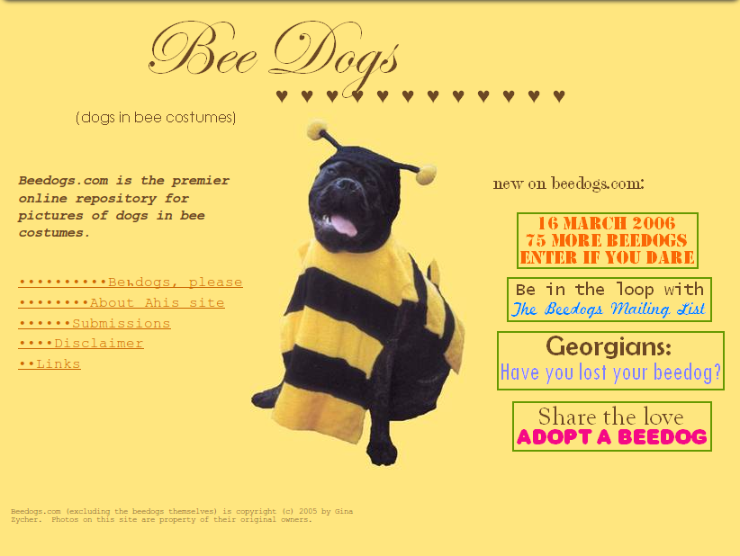

beedog.github.io
================

A static resource for Beedogs, resurrected from the original (now dead)
[site](beedogs.com).

### Background

[beedogs.com](http://beedogs.com) was a great site:



Unfortunately, it hadn't been updated in years and recently went offline.

For the sake of posterity, I grabbed the latest copy of the site from the
[Internet Archive](https://archive.org/web/), did some renaming and converting,
and dumped the images here for all to enjoy.

### Usage

The number of Beedog images is accessible via the plain text [count](./count)
file.

All Beedog images are in PNG format, in sequential non-padded order beginning
with "1".

For example, assuming that [count](./count) contains `200`, the following URLs
would access Beedog images:

```
http://beedog.github.io/image1.png
http://beedog.github.io/image200.png
http://beedog.github.io/image55.png
```

These would **not** be valid Beedog images:

```
http://beedog.github.io/image0.png
http://beedog.github.io/image001.png
http://beedog.github.io/image205.png
```

The order and permanence of a particular Beedog image is **not** guaranteed.

### Contributing

In the spirit of the original site, I'm happy to accept new pictures of Beedogs.
Please only submit images that you're the rightful owner of (or are acceptably
licensed).

Additionally, I probably made some mistakes during image conversion/renaming.
If you find duplicates or know of a missing Beedog, tell me and I'll try to fix
it.

### License

The original [beedogs.com](beedogs.com) was curated by Gina Zycher.

All photos are property of their original owners, just like the original site.

This resurrection was performed by [William Woodruff](http://woodruffw.us) and
all new components are released into the public domain.
